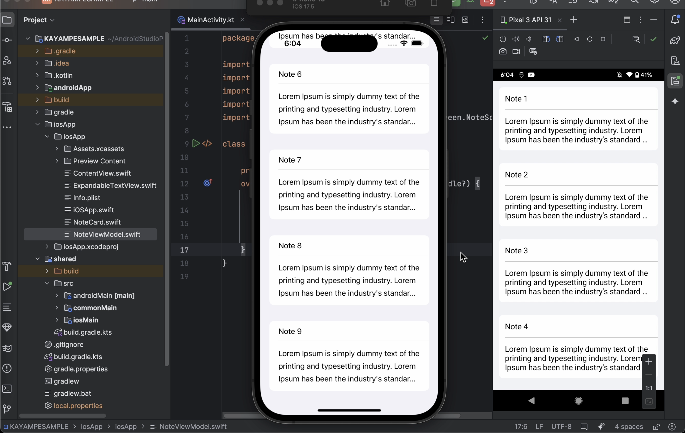

# 📝 Kotlin Multiplatform Note App with Native UI

This is a **sample Kotlin Multiplatform project** featuring a simple **note-taking app** with shared business logic and **native UI implementations**:

- ✅ Jetpack Compose for **Android**
- 🍏 SwiftUI for **iOS**

It demonstrates how to structure a KMP project with platform-specific UI layers while keeping logic (like models, and state management) shared across platforms.

---

## 📸 Preview
Check out the demo to see the app in action:  

---

## 📦 Features
- Right Now it contains simple notes to demonstrate with Expandable Card feature.
- Shared data and logic using Kotlin Multiplatform
- Platform-native UI components

---

## 🛠️ Tech Stack

| Layer         | Android        | iOS          | Shared Code           |
|---------------|----------------|---------------|------------------------|
| UI            | Jetpack Compose | SwiftUI       | —                      |
| Business Logic| —              | —             | Kotlin Multiplatform  |

---

## 🚀 Getting Started

### Requirements
- Android Studio
- Xcode 15+
- Kotlin 1.9+

### Build Instructions

#### Android
1. Open in Android Studio
2. Run the app on an emulator or device

#### iOS
1. Open the `iosApp` project in Xcode
2. Run on a simulator or device

## ✅ TODO

- [ ] Add SQLDelight integration in shared module
- [ ] Implement full CRUD operations using SQLDelight
- [ ] Sync notes across platforms using a shared database layer
- [ ] Add basic UI tests for both platforms
